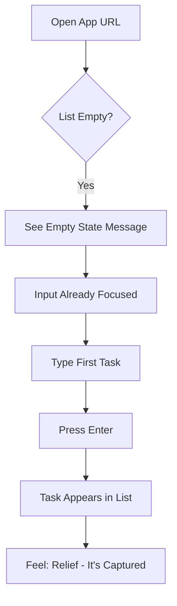
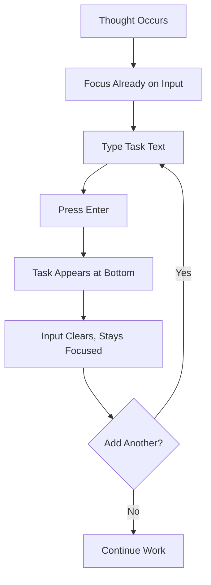
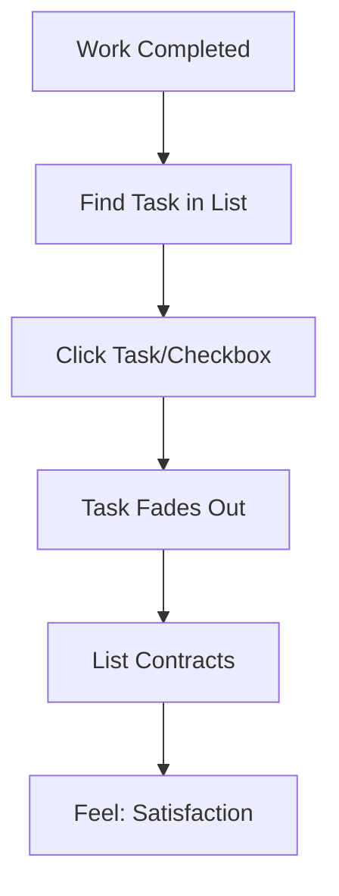
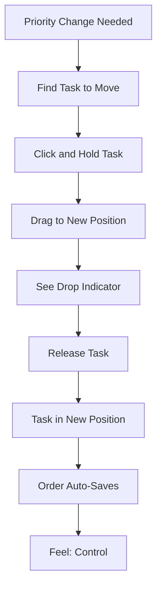
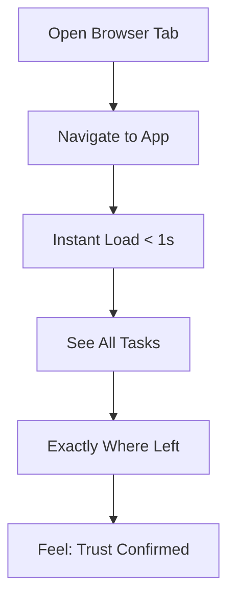

# UX Design Specification simple-todo

**Author:** Tony Stark
**Date:** 2026-01-08

---

## Executive Summary

### Project Vision

simple-todo is a minimalist, web-based task management application that embraces radical simplicity. Inspired by Apple's Reminders app, it provides a clean, distraction-free interface built on one guiding principle: one list, three actions (add, reorder, complete), zero configuration.

The product solves a focused problem: busy professionals forget tasks when relying on scattered methods like sticky notes or mental lists, and existing digital solutions overcomplicate task management with features that add cognitive load rather than reduce it.

### Target Users

**Primary User: The Busy Professional (Alex Chen Persona)**

Mid-to-senior level knowledge workers who juggle multiple responsibilities across work and personal life. They want reliable task capture without friction—the kind of person who just needs to know "what do I need to do today?" without managing projects, tags, due dates, or collaboration overhead.

**Key User Characteristics:**
- Tech-savvy but values simplicity over power features
- Experiences "what am I forgetting?" anxiety with current methods
- Uses the app throughout the day: morning prioritization, ongoing capture, end-of-day review
- Primary device: Desktop browser, with occasional tablet/mobile access
- Success metric: "I added it, I can see it, I won't forget it"

### Key Design Challenges

1. **Radical Simplicity Without Feeling Sparse** - Create an interface that feels complete and polished with only three core actions, avoiding the impression of a feature-incomplete prototype.

2. **Natural Drag-and-Drop Experience** - Deliver immediate, responsive reordering with clear visual feedback that builds user confidence in the interaction.

3. **Zero Learning Curve** - Design an interface so intuitive that new users understand all functionality within 30 seconds without any onboarding.

4. **Responsive Simplicity** - Maintain the clean, desktop-first experience while gracefully adapting to smaller screens.

### Design Opportunities

1. **Delightful Micro-interactions** - Use subtle animations for task completion, drag states, and empty states to create moments of satisfaction that reinforce productivity.

2. **Apple-Inspired Minimalism** - Leverage clean typography, generous whitespace, and refined visual details to create a premium feel despite minimal features.

3. **Trust Through Reliability** - Build user confidence with subtle save confirmations and consistent behavior that reinforces "nothing is ever lost."

## Core User Experience

### Defining Experience

The core experience of simple-todo centers on **frictionless task capture**. The product exists to bridge the gap between "I need to remember this" and "It's captured" in under 2 seconds. Everything else—viewing, reordering, completing—supports this primary value.

**Core Loop:**
1. Thought occurs → Type task → Press Enter → Task captured
2. Work happens → Click task → Task disappears → Progress visible
3. Priority shifts → Drag task → Drop in position → Order saved

The interface should feel like an extension of the user's mind—tasks flow in effortlessly and flow out satisfyingly when complete.

### Platform Strategy

| Aspect | Strategy |
|--------|----------|
| **Platform** | Web application (browser-based SPA) |
| **Primary Input** | Mouse and keyboard (desktop-first) |
| **Secondary Input** | Touch-friendly for tablet/mobile access |
| **Offline Support** | Not in MVP scope |
| **Browser Support** | Modern evergreen browsers (Chrome, Firefox, Safari, Edge) |
| **Responsive Approach** | Desktop-first with graceful adaptation to smaller screens |

**Platform Rationale:** Web-based delivery ensures universal access without app store friction. The single-column layout naturally adapts across devices while maintaining the core simplicity.

### Effortless Interactions

These interactions must require zero cognitive effort:

| Interaction | Effortless Design |
|-------------|-------------------|
| **Add Task** | Input always visible and focused-ready. Type and Enter. No clicks to "start adding." |
| **Complete Task** | Single click anywhere on completion target. Immediate removal. No confirmation. |
| **Reorder Tasks** | Grab task from anywhere, drag to position, release. Auto-saves on drop. |
| **Return to App** | Open URL, see list immediately. No login, no splash screen, no loading state. |
| **Understand State** | Glance at list, know exactly what needs doing. No hidden tasks, no collapsed sections. |

### Critical Success Moments

| Moment | Experience Goal | Success Indicator |
|--------|-----------------|-------------------|
| **First Task Added** | Instant appearance, no friction | User adds 3+ tasks in first session |
| **First Completion** | Satisfying removal, clean result | User completes a task without hesitation |
| **Trust Test** | Refresh browser, tasks persist | User stops worrying about data loss |
| **Priority Shift** | Drag feels natural, saves instantly | User reorders without thinking about "saving" |
| **End of Day** | Empty list feels like accomplishment | User returns the next day |

### Experience Principles

These principles guide all UX decisions for simple-todo:

**1. Capture Over Configure**
Every interaction prioritizes getting tasks captured over organizing them. Speed to capture beats categorization, tagging, or any organizational overhead. If a user has a task in mind, it should be in the system within 2 seconds.

**2. One Action, One Result**
Each user action does exactly one thing with immediate, visible feedback. No modes, no modals, no multi-step flows, no confirmation dialogs. Click complete = task gone. Drag and drop = order saved. Enter = task added.

**3. Trust Through Transparency**
Users always see their data and can trust it persists. No ambiguity about system state. When a task is added, it's visible. When order changes, it's saved. The system behaves predictably every single time.

**4. Simplicity Is The Feature**
What we don't include is as important as what we do. Every feature request is measured against the core value proposition. Constraints are intentional design decisions, not missing features. The flat list, the three actions, the lack of categories—these are features, not limitations.

## Desired Emotional Response

### Primary Emotional Goals

The emotional design of simple-todo centers on transforming anxiety into calm confidence. Users should move from "what am I forgetting?" to "I've got this handled."

| Primary Emotion | Description |
|-----------------|-------------|
| **Relief** | The anxiety of forgotten tasks dissolves when everything is captured in one trusted place |
| **Control** | A flat, prioritized list gives users mastery over their commitments |
| **Calm Focus** | The clean, minimal interface removes visual noise and cognitive load |
| **Satisfaction** | Completing tasks provides visible, rewarding proof of progress |

**The Defining Feeling:** "This just works." — The combination of trust and simplicity that makes users want to share the app with others.

### Emotional Journey Mapping

| Stage | Desired Emotion | Design Support |
|-------|-----------------|----------------|
| **First Discovery** | Curiosity → Instant Understanding | Empty state clearly shows what to do |
| **First Task Added** | Relief → Confidence | Instant appearance, no barriers |
| **During Core Use** | Calm Focus → Flow State | Minimal UI, no distractions |
| **Task Completed** | Satisfaction → Accomplishment | Smooth removal animation |
| **End of Day** | Pride → Closure | Empty list signals success |
| **Something Goes Wrong** | Reassurance → Trust | Data always persists, recoverable state |
| **Returning to App** | Familiarity → Comfort | Everything exactly where it was left |

### Micro-Emotions

**Emotions to Cultivate:**

| Micro-Emotion | Why It Matters |
|---------------|----------------|
| **Confidence** | Every interaction feels obvious and predictable |
| **Trust** | Users believe their data is safe without needing proof |
| **Accomplishment** | Progress is visible and rewarding |
| **Calm** | The interface itself reduces stress |

**Emotions to Prevent:**

| Negative Emotion | How We Avoid It |
|------------------|-----------------|
| **Overwhelm** | Minimal options, single flat list, no features to configure |
| **Doubt** | Instant visual feedback, subtle save confirmations |
| **Impatience** | Fast responses, no loading spinners, instant interactions |
| **Guilt** | No due dates, no overdue indicators, no judgment |

### Design Implications

| Desired Emotion | UX Design Approach |
|-----------------|-------------------|
| **Relief** | Always-visible input field, instant task capture, zero barriers to entry |
| **Control** | Drag-and-drop reordering, visual priority through vertical position |
| **Calm** | Generous whitespace, minimal UI chrome, no notifications or alerts |
| **Satisfaction** | Smooth completion animation, visually shrinking list, progress visibility |
| **Trust** | Subtle save indicator, consistent behavior, zero data loss |
| **Clarity** | Single-column layout, one list only, no hidden or collapsed states |

### Emotional Design Principles

**1. Anxiety Reduction First**
Every design decision should be evaluated against: "Does this reduce or increase user anxiety?" If it adds cognitive load, hesitation, or uncertainty—remove it.

**2. Progress Over Perfection**
The app celebrates completing tasks, not organizing them perfectly. The emotional reward comes from a shrinking list, not a beautifully categorized system.

**3. Silent Reliability**
Trust is built through consistent, quiet behavior. No celebratory notifications, no achievement badges, no gamification. Just reliable persistence and predictable responses.

**4. Judgment-Free Design**
The app never makes users feel bad. No overdue markers, no "you forgot this" reminders, no shame-inducing UI. Tasks exist or they don't—that's it.

## UX Pattern Analysis & Inspiration

### Inspiring Products Analysis

**Primary Inspiration: Apple Reminders**

Apple Reminders exemplifies the "simple done right" approach that simple-todo aims to achieve. Key UX elements to learn from:

| Element | Apple Reminders Approach | simple-todo Application |
|---------|-------------------------|------------------------|
| **List View** | Clean single-column layout with generous spacing | Direct adoption as core layout pattern |
| **Task Entry** | Inline input, tap and type, no modals | Always-visible input field at bottom |
| **Completion** | Single tap with subtle fade animation | Click to complete with smooth removal |
| **Reordering** | Native drag-and-drop with haptic feedback | Drag-and-drop with visual feedback |
| **Visual Design** | Minimal chrome, content-focused, system fonts | Adopt minimalist aesthetic throughout |

### Transferable UX Patterns

**Interaction Patterns:**
- **Always-visible input** - No "add task" button; input field is always ready
- **Single-action operations** - One click/tap completes actions; no confirmation dialogs
- **Direct manipulation** - Drag-and-drop for reordering feels natural and immediate
- **Instant feedback** - Actions reflect immediately in the UI

**Visual Patterns:**
- **Generous whitespace** - Breathing room between tasks reduces visual stress
- **Clean typography** - System fonts for familiarity and performance
- **Subtle separators** - Light borders or shadows distinguish tasks without visual noise
- **Understated animations** - Smooth transitions that feel polished but don't slow users down

### Anti-Patterns to Avoid

| Anti-Pattern | Example Apps | Why We Avoid It |
|--------------|--------------|-----------------|
| **Feature Creep** | Notion, Asana, Monday | Overwhelms users; contradicts radical simplicity |
| **Gamification** | Habitica, Forest | Creates guilt and pressure; we want calm |
| **Due Date Urgency** | Todoist, Any.do | Red overdue badges induce anxiety |
| **Forced Organization** | Things 3, OmniFocus | Categories/projects add cognitive overhead |
| **Onboarding Flows** | Most SaaS products | If it needs explanation, it's too complex |
| **Sync Status Anxiety** | Apps with visible sync indicators | Creates doubt; we save silently |

### Design Inspiration Strategy

**Adopt Directly:**
- Single-column list layout
- Always-visible text input
- Single-click task completion
- Drag-and-drop reordering
- Minimal visual chrome

**Adapt for Simplicity:**
- Apple Reminders has multiple lists → We have one list only
- Apple Reminders has due dates → We have no dates
- Apple Reminders has categories → We have flat priority via position

**Avoid Entirely:**
- Any feature requiring configuration
- Any element that creates time pressure
- Any UI that requires explanation
- Any pattern that adds steps to core actions

## Design System Foundation

### Design System Choice

**Selected Approach: Tailwind CSS (Minimal Custom)**

A utility-first CSS framework with custom components built specifically for simple-todo's minimal needs. No component library - just Tailwind utilities and purpose-built React components.

### Rationale for Selection

| Factor | Decision Driver |
|--------|-----------------|
| **Scope** | Only 4 UI components needed - a design system would be overkill |
| **Aesthetic** | Apple-inspired minimalism requires custom design, not a pre-built look |
| **Performance** | Smallest possible bundle size supports <1s page load target |
| **Philosophy** | Radical simplicity in tooling matches radical simplicity in UX |
| **Stack Fit** | Native Next.js support, zero configuration |
| **Control** | Full design ownership without fighting framework defaults |

**Why NOT a Component Library:**
- MUI, Chakra, etc. bring opinions and overhead we don't need
- Our 4 components don't justify a library dependency
- We want a unique aesthetic, not a recognizable design system look

### Implementation Approach

**Core Components to Build:**

| Component | Responsibility |
|-----------|----------------|
| `TaskList` | Container for tasks, handles empty state |
| `TaskItem` | Individual task with drag handle and completion |
| `TaskInput` | Always-visible text input for adding tasks |
| `EmptyState` | Friendly message when list is empty |

**Tailwind Configuration:**
- Custom color palette (neutral, minimal)
- Custom spacing scale for generous whitespace
- System font stack for native feel
- Subtle shadow utilities for depth

**Animation Strategy:**
- CSS transitions for smooth interactions
- Framer Motion only if needed for drag-and-drop (may use @dnd-kit built-in)
- Keep animations under 200ms for responsiveness

### Customization Strategy

**Design Tokens:**

| Token Category | Approach |
|----------------|----------|
| **Colors** | Minimal palette: background, text, subtle borders, accent for input focus |
| **Typography** | System font stack, 2-3 sizes only (task, input, empty state) |
| **Spacing** | Generous: 16px minimum between tasks, 24px+ padding |
| **Borders** | Subtle: 1px light gray or shadows for separation |
| **Radius** | Slight rounding (4-8px) for softness without being playful |

**Responsive Breakpoints:**
- Desktop-first: optimized for 1024px+
- Tablet: 768px - minor adjustments
- Mobile: 375px+ - stack naturally, increase touch targets

## Defining User Experience

### The Defining Moment

**"Type it, Enter, it's captured—forget about forgetting."**

The defining experience of simple-todo is the instant a user thinks of a task, types it, hits Enter, and sees it appear in their list. This is the magic moment that creates relief and builds trust. Everything else—completing, reordering, viewing—supports this primary interaction.

**How Users Will Describe It:**
"I just type what I need to do and hit Enter. That's it. It's always there when I come back."

### User Mental Model

**Current Solutions Users Bring:**
- Sticky notes scattered on desk
- Mental lists that cause anxiety
- Notes app that requires too many taps
- Complex tools (Todoist, Asana) that feel like work

**Expected Interaction Pattern:**
Type → Appear → Done (like texting a friend)

**Familiar Metaphors:**
- Sending a text message (type, send, delivered)
- Writing on a sticky note (write, stick, see it)
- Making a grocery list (add item, done)

**Friction Points in Existing Solutions:**
- Too many clicks to add a task
- Required categorization before capture
- Forms with multiple fields
- Sync indicators that create doubt

### Success Criteria

| Criteria | Target | Rationale |
|----------|--------|-----------|
| Time from thought to captured | < 2 seconds | Faster than writing a sticky note |
| Clicks required to add | 0 | Just type and Enter |
| Decisions required | 0 | No category, no date, no priority to select |
| Visual confirmation | Instant | Task appears immediately in list |
| Persistence confirmation | Automatic | Task survives refresh without user action |

### Pattern Analysis

**Pattern Type: 100% Established**

All interactions use universal, proven UX patterns:

| Interaction | Pattern | User Familiarity |
|-------------|---------|------------------|
| Add task | Text input + Enter to submit | Universal (search boxes, chat) |
| View tasks | Vertical list | Universal (email, documents) |
| Complete task | Single click/tap | Universal (checkboxes, buttons) |
| Reorder tasks | Drag and drop | Established (file managers, playlists) |

**No Novel UX Required**
This is intentional. "Zero learning curve" means using patterns users already understand. Innovation comes from what we remove, not what we add.

### Experience Mechanics

**1. Task Capture (The Defining Moment)**

| Phase | Implementation |
|-------|----------------|
| **Initiation** | Input field always visible at bottom of viewport; no "add" button to click |
| **Interaction** | User types task text; presses Enter |
| **System Response** | Task appears at bottom of list; input clears and remains focused |
| **Feedback** | Subtle animation as task slides into list |
| **Completion** | User sees task in list; feels relief of capture |

**2. Task Completion**

| Phase | Implementation |
|-------|----------------|
| **Initiation** | User identifies a completed task |
| **Interaction** | Single click on task or checkbox area |
| **System Response** | Task fades out smoothly (150-200ms) |
| **Feedback** | List contracts to fill space; count updates |
| **Completion** | Task is gone; user feels accomplishment |

**3. Task Reordering**

| Phase | Implementation |
|-------|----------------|
| **Initiation** | User decides task priority needs to change |
| **Interaction** | Click and hold task; drag to new position |
| **System Response** | Placeholder shows drop target; other tasks animate to make room |
| **Feedback** | Visual confirmation of new position |
| **Completion** | Task in new position; order auto-saves; user feels control |

## Visual Design Foundation

### Color System

**Palette: Neutral Minimalist**

A calm, content-focused palette that supports readability and reduces visual stress. No bold colors, no gradients—just purposeful neutrals with a single accent for interaction states.

| Role | Value | Usage |
|------|-------|-------|
| **Background** | `#FFFFFF` | Main app background |
| **Surface** | `#FAFAFA` | Subtle card/container backgrounds if needed |
| **Text Primary** | `#1A1A1A` | Task text, headings |
| **Text Secondary** | `#6B7280` | Placeholder text, empty state |
| **Border** | `#E5E7EB` | Task separators, input border |
| **Hover** | `#F3F4F6` | Task hover state |
| **Focus Accent** | `#3B82F6` | Input focus ring, interactive highlights |

**Color Principles:**
- Background is pure white for maximum cleanliness
- Text uses dark gray (not black) for comfortable reading
- Borders are barely visible—just enough to separate tasks
- Single accent color only appears on interaction (focus, active states)
- No color coding, badges, or visual "importance" indicators

### Typography System

**Font Stack: System Native**

```css
font-family: -apple-system, BlinkMacSystemFont, "Segoe UI", Roboto, "Helvetica Neue", Arial, sans-serif;
```

**Rationale:** System fonts provide native familiarity, zero load time, and excellent rendering across all platforms.

**Type Scale:**

| Element | Size | Weight | Color |
|---------|------|--------|-------|
| **Task Text** | 16px (1rem) | 400 (regular) | Text Primary |
| **Input Text** | 16px (1rem) | 400 (regular) | Text Primary |
| **Input Placeholder** | 16px (1rem) | 400 (regular) | Text Secondary |
| **Empty State Heading** | 18px (1.125rem) | 500 (medium) | Text Primary |
| **Empty State Body** | 16px (1rem) | 400 (regular) | Text Secondary |

**Typography Principles:**
- Single font size for all task content (16px) ensures scannability
- No bold task text—all tasks are equal weight
- Line height of 1.5 for comfortable reading
- No decorative fonts or styles

### Spacing & Layout Foundation

**Base Unit: 8px**

All spacing derives from an 8px base unit for consistency and easy scaling.

**Spacing Scale:**

| Token | Value | Usage |
|-------|-------|-------|
| `space-1` | 4px | Tight spacing (icon gaps) |
| `space-2` | 8px | Standard gap (between tasks) |
| `space-3` | 12px | Internal padding (within task items) |
| `space-4` | 16px | Component padding (task item padding) |
| `space-6` | 24px | Section spacing (container padding) |
| `space-8` | 32px | Large spacing (top/bottom margins) |

**Layout Structure:**

| Element | Specification |
|---------|---------------|
| **Container Max-Width** | 512px (centered) |
| **Container Padding** | 24px horizontal |
| **Task Item Padding** | 16px vertical, 16px horizontal |
| **Task Gap** | 8px between items |
| **Input Height** | 48px (comfortable touch target) |
| **Border Radius** | 6px (subtle softness) |

**Layout Principles:**
- Centered single-column layout creates focus
- Generous whitespace reduces visual stress
- Consistent padding creates rhythm
- Max-width prevents eye-strain from long lines

### Accessibility Considerations

**Color Contrast:**
- Text Primary on Background: 15.3:1 (exceeds WCAG AAA)
- Text Secondary on Background: 4.9:1 (meets WCAG AA)
- Focus Accent on Background: 4.5:1 (meets WCAG AA)

**Interaction Accessibility:**
- All interactive elements have visible focus states
- Touch targets minimum 44px (input is 48px)
- No color-only information (no red/green status)
- Keyboard navigation: Tab through tasks, Enter to add, Escape to cancel

**Motion Accessibility:**
- Respect `prefers-reduced-motion` media query
- Animations under 200ms for responsiveness
- No essential information conveyed only through animation

## Design Direction

### Design Approach

**Direction: Clean Minimal**

Given simple-todo's philosophy of radical simplicity, the design direction follows naturally from our established constraints. Rather than exploring dramatically different visual approaches, we commit to the most minimal expression possible.

**Design Philosophy:** Remove everything that doesn't directly support task capture, completion, and reordering. Every visual element must earn its place.

### Visual Structure

**Layout:**
```
┌─────────────────────────────────────┐
│           [Empty Space]             │
│                                     │
│  ┌─────────────────────────────┐   │
│  │ ○  Task item text here      │   │
│  ├─────────────────────────────┤   │
│  │ ○  Another task             │   │
│  ├─────────────────────────────┤   │
│  │ ○  Third task               │   │
│  └─────────────────────────────┘   │
│                                     │
│  ┌─────────────────────────────┐   │
│  │ Add a task...               │   │
│  └─────────────────────────────┘   │
└─────────────────────────────────────┘
```

**Key Visual Decisions:**

| Element | Design Choice | Rationale |
|---------|---------------|-----------|
| **Task Separator** | 1px bottom border (`#E5E7EB`) | Minimal visual weight, clear separation |
| **Completion Target** | Circle outline on left | Universal checkbox metaphor |
| **Task Container** | No cards, no shadows | Maximum simplicity |
| **Input Placement** | Fixed at bottom | Always visible, always ready |
| **Empty State** | Centered text, friendly tone | Clear call-to-action |

### Component States

**Task Item States:**

| State | Visual Treatment |
|-------|------------------|
| **Default** | White background, dark text, subtle bottom border |
| **Hover** | Light gray background (`#F3F4F6`) |
| **Dragging** | Slight elevation (shadow), reduced opacity on original position |
| **Drop Target** | Visual indicator where task will land |

**Input States:**

| State | Visual Treatment |
|-------|------------------|
| **Default** | Light border, placeholder text |
| **Focused** | Blue focus ring (`#3B82F6`), no placeholder |
| **With Text** | Dark text, ready to submit |

**Empty State:**
- Centered in viewport
- Friendly heading: "No tasks yet"
- Subtle body: "Add your first task below"
- Input remains visible and focused

### Design Rationale

**Why This Direction:**

1. **Aligns with Core Philosophy** - Radical simplicity means the simplest possible visual expression
2. **Supports Calm Emotional Goal** - No visual noise, no competing elements, just content
3. **Maximizes Content Focus** - Tasks are the only visual focus; UI disappears
4. **Enables Fast Performance** - No images, no complex CSS, instant rendering
5. **Reduces Decision Fatigue** - One clear path forward, no visual complexity

**What We Deliberately Excluded:**
- Card-based task items (adds visual weight)
- Shadows and depth (unnecessary complexity)
- Icons beyond completion circle (visual noise)
- Color coding or status indicators (contradicts judgment-free design)
- Header or navigation (single view, no navigation needed)

## User Journey Flows

### Journey 1: First-Time User

**Scenario:** New user opens the app for the first time



**Key Moments:**
- Instant understanding of what to do (empty state guides)
- No onboarding, no tutorial, no account creation
- First task added within 10 seconds of arrival

### Journey 2: Task Capture

**Scenario:** User thinks of something they need to remember



**Key Moments:**
- < 2 seconds from thought to captured
- Zero clicks required (just type and Enter)
- Can rapid-fire multiple tasks without pause

### Journey 3: Task Completion

**Scenario:** User finishes a task and wants to mark it done



**Key Moments:**
- Single click to complete (no confirmation)
- Satisfying fade-out animation
- Immediate visual feedback of progress

### Journey 4: Priority Reordering

**Scenario:** User needs to change task priority



**Key Moments:**
- Intuitive drag-and-drop (familiar pattern)
- Visual feedback during drag (drop indicator)
- Instant auto-save (no save button)

### Journey 5: Return Visit

**Scenario:** User returns to the app after time away



**Key Moments:**
- No login required
- Instant load (< 1 second)
- Data exactly as left (builds trust)

### Journey Patterns

**Common patterns identified across all user journeys:**

| Pattern | Description | Implementation |
|---------|-------------|----------------|
| **Instant Feedback** | Every action shows immediate visual response | Animations < 200ms, no loading states |
| **No Decisions** | No modals, confirmations, or choices required | Single-action operations throughout |
| **Silent Persistence** | Auto-save on every change | No save button, no sync indicators |
| **Single Path** | One clear way to accomplish each goal | No alternative methods or shortcuts |
| **Recovery by Repetition** | Mistakes fixed by doing action again | No undo, just add/complete/reorder again |

### Flow Optimization Principles

**1. Zero-Step Entry**
The input field is always ready. No "add task" button, no modal to open. Cursor can be in input on page load.

**2. One-Click Actions**
Complete and reorder are single-interaction operations. No confirmation dialogs, no multi-step processes.

**3. No Dead Ends**
Every state naturally leads to the next action. Empty state guides to adding. Full list invites completing.

**4. Invisible Infrastructure**
Users never think about saving, syncing, or loading. The system handles persistence silently.

**5. Graceful Simplicity**
Error handling is minimal because errors are rare. If something fails, the solution is to try again.

## Component Strategy

### Design System Components

**Framework: Tailwind CSS (Minimal Custom)**

No pre-built component library. All components are custom-built using Tailwind utility classes. This provides:
- Full design control aligned with radical simplicity philosophy
- Zero component library overhead
- Smallest possible bundle size
- No fighting framework opinions

### Custom Components

**1. TaskList**

| Aspect | Specification |
|--------|---------------|
| **Purpose** | Container for all tasks; orchestrates list rendering and empty state |
| **Props** | `tasks: Task[]`, `onComplete: (id) => void`, `onReorder: (tasks) => void` |
| **States** | Empty (renders EmptyState), Populated (renders TaskItems) |
| **Accessibility** | `role="list"`, `aria-label="Task list"` |

**Behavior:**
- Renders EmptyState when `tasks.length === 0`
- Wraps TaskItems in drag-and-drop context
- Handles reorder callbacks on drop

---

**2. TaskItem**

| Aspect | Specification |
|--------|---------------|
| **Purpose** | Display single task with completion and drag functionality |
| **Props** | `task: Task`, `onComplete: () => void` |
| **States** | Default, Hover, Dragging, Drop Target |
| **Accessibility** | `role="listitem"`, `aria-label="Task: {text}"`, `button` for completion |

**Visual States:**

| State | Styling |
|-------|---------|
| Default | `bg-white border-b border-gray-200` |
| Hover | `bg-gray-50` |
| Dragging | `shadow-lg opacity-90` |
| Drop Target | `border-blue-500 border-2` |

**Anatomy:**
```
┌─────────────────────────────────────┐
│ [○]  Task text here                 │
└─────────────────────────────────────┘
  ↑     ↑
  │     └── Task text (fills remaining space)
  └── Completion circle (click target)
```

---

**3. TaskInput**

| Aspect | Specification |
|--------|---------------|
| **Purpose** | Text input for adding new tasks |
| **Props** | `onSubmit: (text) => void`, `autoFocus?: boolean` |
| **States** | Default (placeholder), Focused, With Text |
| **Accessibility** | `aria-label="Add a task"`, `placeholder="Add a task..."` |

**Visual States:**

| State | Styling |
|-------|---------|
| Default | `border border-gray-200`, placeholder visible |
| Focused | `ring-2 ring-blue-500`, placeholder hidden |
| With Text | Dark text, ready to submit |

**Behavior:**
- Enter key submits and clears input
- Remains focused after submit for rapid entry
- Empty submit is ignored (no validation error shown)

---

**4. EmptyState**

| Aspect | Specification |
|--------|---------------|
| **Purpose** | Guide first-time users when list is empty |
| **Props** | None |
| **States** | Single state |
| **Accessibility** | `aria-live="polite"` |

**Content:**
- Heading: "No tasks yet"
- Body: "Add your first task below"
- Centered vertically in available space

### Component Implementation Strategy

**Technology Choices:**

| Concern | Solution |
|---------|----------|
| **Styling** | Tailwind CSS utility classes |
| **Drag-and-Drop** | `@dnd-kit/core` + `@dnd-kit/sortable` |
| **Animations** | CSS transitions + dnd-kit built-in |
| **State** | React useState/useEffect (no external state library) |

**Implementation Principles:**
- Components are functional React components
- No class components, no HOCs
- Props typed with TypeScript interfaces
- Tailwind classes applied directly (no CSS files)
- Transitions via Tailwind's `transition` utilities

### Implementation Roadmap

**Phase 1: Core MVP (All Critical)**

All 4 components are critical for MVP—there is no phasing. The app doesn't function without any of them.

| Component | Dependencies | Implementation Order |
|-----------|--------------|---------------------|
| `TaskInput` | None | 1st - Enables task capture |
| `TaskItem` | @dnd-kit | 2nd - Displays tasks |
| `TaskList` | TaskItem, EmptyState | 3rd - Orchestrates list |
| `EmptyState` | None | 4th - Completes experience |

**Dependency Installation:**
```bash
npm install @dnd-kit/core @dnd-kit/sortable @dnd-kit/utilities
```

**No Future Phases**
The component set is intentionally complete. No additional components planned—simplicity is the feature.

## UX Consistency Patterns

### Pattern Categories

Given simple-todo's radical simplicity, most traditional UX pattern categories don't apply. We intentionally exclude:
- Button hierarchy (no buttons except implicit completion click)
- Navigation patterns (single view)
- Modal/overlay patterns (no dialogs)
- Search/filtering patterns (single flat list)
- Form validation patterns (single text input, no validation)

**Patterns that matter for simple-todo:**

| Pattern Category | Relevance |
|------------------|-----------|
| Interaction Feedback | Critical |
| State Patterns | Critical |
| Keyboard Patterns | Important |
| Error Handling | Minimal |

### Interaction Feedback Patterns

**Task Added:**

| Aspect | Pattern |
|--------|---------|
| **Visual** | Task slides into list from bottom |
| **Timing** | < 150ms animation |
| **Sound** | None (silent operation) |
| **Confirmation** | Task visible in list is the confirmation |

**Task Completed:**

| Aspect | Pattern |
|--------|---------|
| **Visual** | Task fades out, list contracts smoothly |
| **Timing** | 150-200ms animation |
| **Sound** | None (silent operation) |
| **Confirmation** | Task removal is the confirmation |

**Task Reordered:**

| Aspect | Pattern |
|--------|---------|
| **Visual** | Smooth animation to new position, other tasks shift |
| **Timing** | Immediate on drop |
| **Sound** | None (silent operation) |
| **Confirmation** | Position change + silent auto-save |

### State Patterns

**Loading State:**
- Initial page load: Target < 1 second
- No loading spinners or skeleton screens
- If slow network: Show stale cached data immediately, update silently when fresh data arrives
- Philosophy: Users should never see "loading"

**Empty State:**
- Centered message: "No tasks yet"
- Subtext: "Add your first task below"
- Input already focused and ready for typing
- Tone: Friendly invitation, not empty void

**Error State:**
- No error dialogs or toasts
- If save fails: Retry silently in background
- If persistent failure: Subtle non-intrusive indicator (last resort only)
- Philosophy: Errors are infrastructure problems, not user problems

### Keyboard Patterns

| Key | Action | Context |
|-----|--------|---------|
| `Enter` | Submit task | Input focused |
| `Tab` | Move focus to next interactive element | Anywhere |
| `Shift+Tab` | Move focus to previous element | Anywhere |
| `Escape` | Clear input text | Input focused |
| `Space` | Complete task | Task focused (accessibility) |

**Keyboard Design Principles:**
- All functionality accessible via keyboard
- Focus states clearly visible (blue ring)
- Tab order follows visual order (top to bottom)
- No keyboard traps

### Animation Patterns

**Timing Guidelines:**

| Animation Type | Duration | Easing |
|----------------|----------|--------|
| Task appear | 150ms | ease-out |
| Task fade out | 200ms | ease-in |
| Drag movement | Real-time | linear |
| List reflow | 150ms | ease-out |
| Focus ring | 100ms | ease-in-out |

**Motion Principles:**
- All animations under 200ms (feel instant)
- Respect `prefers-reduced-motion` (disable animations if set)
- No bouncing, no overshoot, no playful physics
- Motion serves function, not decoration

### Persistence Patterns

**Auto-Save Behavior:**
- Save triggers: Task added, task completed, task reordered
- Save timing: Immediate (debounced if rapid actions)
- Save indication: None visible to user
- Save failure: Silent retry, eventual consistency

**Data Integrity:**
- Optimistic updates (UI changes immediately)
- Background sync to server
- No "unsaved changes" warnings
- Trust the system, not the user to save

## Responsive Design & Accessibility

### Responsive Strategy

**Approach: Desktop-First with Natural Mobile Adaptation**

The single-column layout is inherently responsive—it doesn't need to "collapse" because it's already minimal. The same layout works across all devices with minor adjustments for touch targets.

**Desktop (Primary - 1024px+):**
- Centered container: 512px max-width
- 24px horizontal padding
- Mouse and keyboard optimized
- Full drag-and-drop functionality

**Tablet (768px - 1023px):**
- Same layout, same container
- Slightly larger touch targets
- Touch-based drag-and-drop
- No layout changes needed

**Mobile (< 768px):**
- Full-width minus padding (16px each side)
- 48px minimum touch targets
- Touch-optimized drag handle
- Same single-column experience

### Breakpoint Strategy

**Desktop-First CSS Approach**

| Breakpoint | Width | Container | Touch Target |
|------------|-------|-----------|--------------|
| **Desktop** | 1024px+ | 512px centered | 44px (mouse) |
| **Tablet** | 768px - 1023px | 512px centered | 48px |
| **Mobile** | < 768px | 100% - 32px padding | 48px |

**Tailwind Breakpoint Implementation:**
```css
/* Default: Desktop */
.container { max-width: 512px; }

/* Tablet and below */
@media (max-width: 1023px) {
  .task-item { min-height: 48px; }
}

/* Mobile */
@media (max-width: 767px) {
  .container { max-width: 100%; padding: 0 16px; }
}
```

**Why Desktop-First:**
- Primary use case is desktop (per PRD)
- Mobile experience is identical layout, just wider relative to screen
- Simpler CSS without mobile-first breakpoint stacking

### Accessibility Strategy

**Target: WCAG 2.1 Level AA**

Industry-standard accessibility compliance appropriate for simple-todo.

**Compliance Checklist:**

| Requirement | Implementation | Status |
|-------------|----------------|--------|
| **Color Contrast** | 15.3:1 primary, 4.9:1 secondary | Exceeds AA |
| **Keyboard Navigation** | All actions keyboard-accessible | Required |
| **Focus Indicators** | 2px blue ring on all interactive elements | Required |
| **Touch Targets** | 48px minimum height | Required |
| **Screen Readers** | Semantic HTML + ARIA labels | Required |
| **Motion Sensitivity** | Respect `prefers-reduced-motion` | Required |

**Semantic HTML Structure:**
```html
<main>
  <ul role="list" aria-label="Task list">
    <li role="listitem">
      <button aria-label="Complete task: {text}">○</button>
      <span>{task text}</span>
    </li>
  </ul>
  <input
    type="text"
    aria-label="Add a task"
    placeholder="Add a task..."
  />
</main>
```

**Screen Reader Announcements:**
- Task added: "{task text} added to list"
- Task completed: "{task text} completed"
- Task reordered: "{task text} moved to position {n}"

### Testing Strategy

**Responsive Testing:**

| Tool | Purpose |
|------|---------|
| Chrome DevTools | Device simulation, responsive debugging |
| Real iOS device | Safari touch behavior, actual performance |
| Real Android device | Chrome touch behavior, drag-and-drop |

**Accessibility Testing:**

| Tool | Purpose | Target |
|------|---------|--------|
| Lighthouse | Automated accessibility audit | Score: 100 |
| axe DevTools | Detailed WCAG violation detection | 0 violations |
| VoiceOver (macOS) | Screen reader testing | Full functionality |
| Keyboard only | Navigation testing | All actions accessible |

**Manual Testing Checklist:**
- [ ] Tab through all interactive elements
- [ ] Complete task using keyboard only
- [ ] Add task using keyboard only
- [ ] Verify focus never gets trapped
- [ ] Test with screen reader enabled
- [ ] Verify animations disabled with `prefers-reduced-motion`

### Implementation Guidelines

**Responsive Development:**
- Use Tailwind's responsive prefixes (`md:`, `lg:`)
- Test on real devices, not just emulators
- Verify touch drag-and-drop works smoothly
- Ensure text remains readable at all sizes

**Accessibility Development:**
- Use semantic HTML elements (`<main>`, `<ul>`, `<li>`, `<button>`)
- Add `aria-label` to all interactive elements without visible text
- Implement `aria-live` regions for dynamic content announcements
- Test keyboard navigation during development, not as afterthought
- Use Tailwind's `focus-visible:` for focus styles

**Code Examples:**

```tsx
// Accessible task completion button
<button
  onClick={onComplete}
  aria-label={`Complete task: ${task.text}`}
  className="focus-visible:ring-2 focus-visible:ring-blue-500"
>
  <Circle className="w-5 h-5" />
</button>

// Reduced motion support
<div className="transition-opacity duration-200 motion-reduce:transition-none">
  {/* Task content */}
</div>
```
